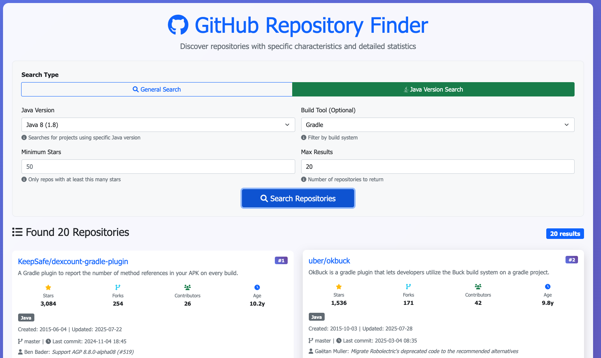

# GitHub Repository Finder

This tool helps you find and analyze GitHub repositories based on specific characteristics.

## Screenshot



## Features

### 🌐 Web Interface
- **Modern UI**: Beautiful, responsive web interface with Bootstrap styling
- **Advanced Search**: Filter by language, topics, stars, forks, and custom queries
- **Rich Statistics**: Repo age, contributors count, commits count, open issues, license info
- **Interactive Display**: Card-based layout with hover effects and detailed views
- **Mobile Friendly**: Responsive design that works on all devices

### 💻 Command Line Interface
- **Flexible Search**: Search repositories by multiple criteria simultaneously
- **Table Display**: Enhanced tabular output with comprehensive statistics
- **Repository Analysis**: Analyze specific repositories for build tools and frameworks
- **Detailed Stats**: Age, contributors, commits, stars, forks, and more

### 📊 Enhanced Statistics
- Repository age (in years)
- Contributors count
- Total commits count
- Open issues count
- License information
- Last updated date
- Repository size
- Topics and language detection

## Setup

### 1. Create and Activate Virtual Environment

```bash
# Create a virtual environment
python3 -m venv venv

# Activate the virtual environment
# On macOS/Linux:
source venv/bin/activate

# On Windows:
# venv\Scripts\activate
```

### 2. Install Dependencies

```bash
pip install -r requirements.txt
```

### 3. Create Environment File

Create a `.env` file in the project root with your GitHub token:
```
GITHUB_TOKEN=your_github_token_here
```

You can get a GitHub token by:
1. Going to GitHub Settings -> Developer Settings -> Personal Access Tokens
2. Generate a new token with `repo` scope

## Troubleshooting

### Package Installation Error

If you encounter this error when running `pip install -r requirements.txt`:

```
ERROR: Could not find a version that satisfies the requirement python-github==2.1.1
ERROR: No matching distribution found for python-github==2.1.1
```

This means the requirements.txt file had an incorrect package name. The correct package name is `PyGithub`, not `python-github`. 

**Solution**: The requirements.txt file has been updated to use the correct package name. Try running the installation command again:

```bash
pip install -r requirements.txt
```

If you still have issues, you can install the packages individually:

```bash
pip install requests==2.31.0
pip install python-dotenv==1.0.0
pip install tqdm==4.66.1
pip install PyGithub==1.59.1
```

### Authentication Error (401 Bad Credentials)

If you see this error when running the script:

```
Error searching repositories: 401 {"message": "Bad credentials", "documentation_url": "https://docs.github.com/rest", "status": "401"}
```

This means there's an issue with your GitHub token. Check the following:

1. **Token Format**: Make sure your token in `.env` is complete and properly formatted:
   - Classic tokens start with `ghp_`
   - Fine-grained tokens start with `github_pat_`
   - Tokens are typically 40+ characters long

2. **Token Permissions**: Ensure your token has the correct scopes:
   - `public_repo` (to access public repositories)
   - `read:user` (to read user profile data)

3. **Token Expiration**: Check if your token has expired and generate a new one if needed

4. **Test Your Token**: You can test your token by running:
   ```bash
   curl -H "Authorization: Bearer YOUR_TOKEN_HERE" https://api.github.com/user
   ```

## Usage

### Option 1: Web Interface (Recommended)

Start the web application:
```bash
python webapp.py
```

Then open your browser and go to: http://localhost:8080

The web interface provides:
- 🎨 Beautiful, modern UI with responsive design
- 📊 Enhanced statistics display (repo age, contributors, commits, etc.)
- 📋 Interactive table format with sorting
- 🔍 Advanced search filters
- 📱 Mobile-friendly design

### Option 2: Command Line Interface

#### Search Repositories
```bash
python github_repo_finder.py --query "java" --language "Java" --topics "maven" "angular" --stars 100
```

#### Analyze a Specific Repository
```bash
python github_repo_finder.py --analyze "https://github.com/example/repo"
```

## Examples

1. Find Java repositories using Maven and Angular:
```bash
python github_repo_finder.py --query "java" --language "Java" --topics "maven" "angular"
```

2. Find repositories with at least 100 stars:
```bash
python github_repo_finder.py --query "java" --stars 100
```

3. Analyze a specific repository:
```bash
python github_repo_finder.py --analyze "https://github.com/spring-projects/spring-boot"
```
